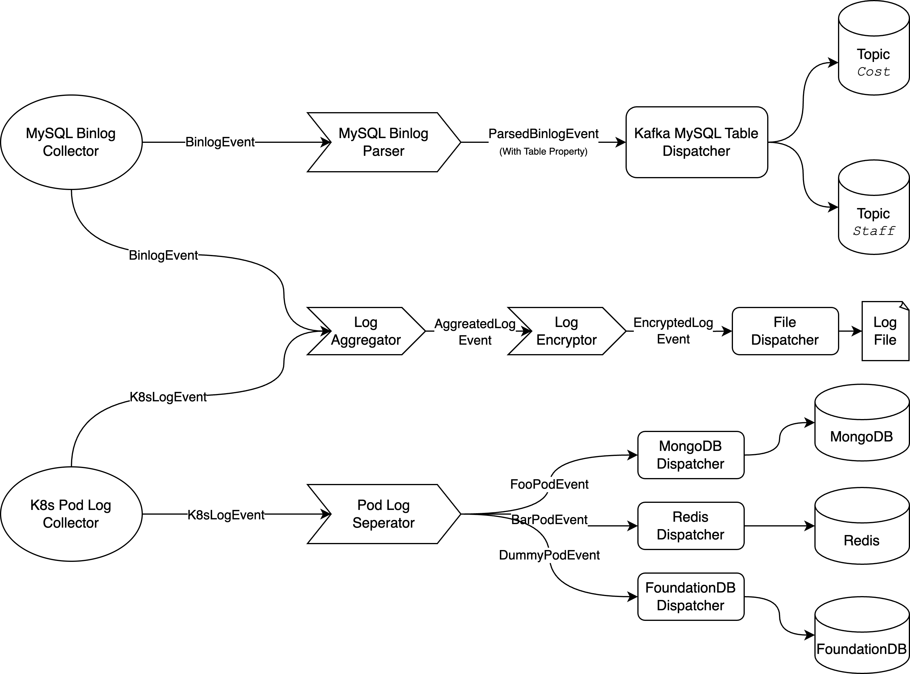

# Wasm Log Flex

> The ultimate log processing framework for the WebAssembly platform.

Wasm Log Flex(`wlf`) is a log processing frame created for the WebAssembly platform. Like many other popular frameworks, our log processing framework will consist of three main `component`s:

- `Collector`: collecting logs from various services (e.g., MySQL Binlog, Docker, Kubernetes, and File).
- `Transformer`: manipulate logs emitted from collectors or other transformers.
- `Dispatcher`: dispatch processed logs to their final destinations (e.g., Kafka, Redis, ElasticSearch).

Components communicate with each other using custom `Event`. They can be chained together to form a pipeline, like this:



Currently, we have the MySQL Binlog collector, the kafka and redis dispatchers, the binlog filter and event replicator transformers. 

Developers can easily create their own components by implementing the `ComponentApi` trait:

```Rust
#[async_trait]
pub trait ComponentApi: 'static + Send + Sync {
    // Returns the unique id of the component.
    fn id(&self) -> &str;
    // Return the component kind(collector, transformer, or dispatcher)
    fn kind(&self) -> ComponentKind;
    // Run the component. Use the `router` to recv/send events from/to other components
    async fn run(&self, router: Arc<EventRouter>) -> Result<(), Box<dyn Error>>;
}
```

In additional to use the library, users who just want a quick setup can use the `wlf-aio`(wasm-log-flex-all-in-one) binary, which packs all the components and can be easily configured.

## Quick Start(using `wlf-aio`)

1. To use the `wlf`, use docker to initiate a local environment `docker compose -f examples/binlog_to_kafka_redis.docker-compose.yaml up -d`, which brings up a kafka, a mysql, and a redis.

2. Build the `wlf-aio` binary: `cargo build --target=wasm32-wasi -p wlf-aio -r`.

3. Install the Wasmedge WebAssembly runtime: https://wasmedge.org/docs/start/install.

4. Run the example: `wasmedge --dir /configs:examples/configs target/wasm32-wasi/debug//wlf-aio.wasm --config /configs/binlog_to_kafka_redis.yaml`

The example uses the following configuration:
```yaml
collectors:
  - id: binlog_collector
    type: BinlogCollector
    destination: filter
    user: root
    password: password
transformers:
  - id: filter
    type: BinlogFilter
    destination: replicator
    rules:
      - exclude:
          database: d1
      - include:
          database: d1
          table: t1
  - id: replicator
    type: EventReplicator
    destinations:
      - redis
      - kafka
dispatchers:
  - id: kafka
    type: KafkaDispatcher
    topic: logFlex.%{/database}.%{/table}
    bootstrap_brokers: ["127.0.0.1:9092"]
  - id: redis
    type: RedisDispatcher
    mode:
      type: Pub
      channel: logFlex.%{/database}.%{/table}
```
The example collects `Binlog` events from Mysql Binlog, filters and replicates them, and then forward them to both kafka and redis.
